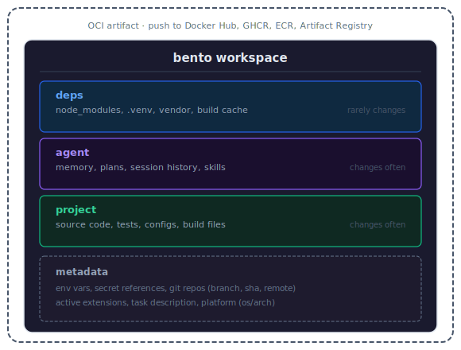

# 🍱 bento

> **Warning:** This project is under heavy development. Expect breaking changes to the CLI, configuration format, and artifact structure between releases.

**Portable agent workspaces. Pack, ship, resume.**


Bento packages AI agent workspace state into portable, layered OCI artifacts. Save a checkpoint of your code, agent memory, and dependencies. Push it to any container registry. Open it anywhere.

Works with any agent. Works on macOS, Linux, and Windows. Works offline. One binary.

```bash
bento init                          # start tracking a workspace
bento save -m "auth module done"    # checkpoint
bento open cp-3                     # restore (backs up current state first)
bento open undo                     # undo the last open
bento open cp-1 ~/workspace-b      # parallel workspace (like git worktrees)
bento push                          # share via registry
```

## The Problem

AI coding agents checkpoint code via git, but lose everything else when the session ends: installed dependencies, agent memory, tool configurations, build caches, conversation history.

Git tracks your source code. **Bento tracks everything git doesn't.**

## How It Works

Each `bento save` captures your workspace as a **bento workspace**, a portable OCI artifact containing your files, agent state, and dependencies organized into layers:

<p align="center">
  
</p>

Layers that haven't changed share digests and aren't re-uploaded. Your 200MB `node_modules` is stored once, not once per checkpoint.

Each checkpoint also stores workspace metadata: environment variables, secret references (resolved on demand, never stored), the git repos the workspace depends on (branch, sha, remote for each), active extensions, and the OS/arch it was created on. This makes checkpoints self-describing so `bento open` on a new machine knows what the workspace needs.

## Install

```bash
# macOS / Linux (Homebrew)
brew tap kajogo777/bento
brew install kajogo777/bento/bento

# Upgrade
brew upgrade kajogo777/bento/bento

# From source
go install github.com/kajogo777/bento@latest

# Or download a binary from GitHub Releases
# https://github.com/kajogo777/bento/releases
```

> **Note:** A different `bento` package exists in homebrew-core. Always use the fully-qualified `kajogo777/bento/bento` to get the right one.

## Quick Start

```bash
cd my-project
bento init
# Detected agent: claude-code

bento save -m "refactored auth module"
# Scanning workspace...
#   deps:     1204 files, 89MB (unchanged, reusing)
#   agent:    8 files, 64KB (changed)
#   project:  42 files, 128KB (changed)
# Tagged: cp-1, latest

# Keep working, save more checkpoints...
bento save -m "added tests"
# Tagged: cp-2, latest

# Something went wrong? Restore an earlier checkpoint
bento open cp-1
# To undo: bento open undo

# Parallel workspaces — agents work independently from the same checkpoint
bento open cp-1 ~/workspace-a
bento open cp-1 ~/workspace-b

# Push to a registry
bento push ghcr.io/myorg/workspaces/my-project
```

## Core Concepts

### Checkpoints

Immutable, content-addressed snapshots of your workspace. Each directory tracks its own position via a `head` field in `bento.yaml`, enabling parallel workspaces like git worktrees. Checkpoints form a DAG through parent references:

```
cp-1 → cp-2 → cp-3 → cp-4 (workspace A)
          ↘→ cp-5 → cp-6 (workspace B)
```

### Layers

Three core layers, ordered bottom to top:

| Layer | Contents | Change frequency |
|-------|----------|-----------------|
| **deps** | Installed packages, build caches | Rarely |
| **agent** | Agent memory, plans, skills, commands | Often |
| **project** | Everything else (source, tests, configs, binaries) | Often |

The project layer is a catch-all. Any workspace file not matched by agent or deps patterns is captured here.

Unchanged layers are deduplicated automatically. Custom layers can be defined in `bento.yaml`.

### Auto-Detection

Bento uses composable **extensions** that auto-detect agents, languages, and tools in your workspace on every `save` and `diff`. If you add a new agent or framework mid-project, bento picks it up automatically.

```bash
bento init
# Detected extensions: claude-code, agents-md, node

# Later, start using Codex too...
bento save -m "multi-agent"
# Detected extensions: claude-code, codex, agents-md, node
```

Each extension contributes patterns to the right layer. Multiple extensions merge naturally -- their patterns are unioned into the same layer. Extensions capture a superset of all known storage paths across agent versions, so state is never silently missed when a user runs an older or newer release. Directories that do not exist on disk cost nothing (no files matched = no bytes in the layer).

Built-in agent extensions: **Claude Code**, **Codex**, **OpenCode**, **OpenClaw**, **Cursor**, **Stakpak**, **AGENTS.md** (cross-agent).
Built-in deps extensions: **Node** (npm, yarn, pnpm, bun, deno), **Python** (pip, uv, pipenv, poetry), **Go**, **Rust**, **Ruby**, **Elixir**, **OCaml**.
Built-in tool extensions: **tool-versions** (asdf / mise).

Define custom layers in `bento.yaml` for unsupported agents. Patterns starting with `~/` or `/` capture files from outside the workspace:

```yaml
layers:
  - name: deps
    patterns: [".venv/**", "~/.cache/pip/"]
  - name: agent
    patterns: [".my-agent/**", "~/.my-agent/sessions/"]
  - name: project
    patterns: ["**"]
```

### Hooks

Optional shell commands at lifecycle points:

```yaml
hooks:
  pre_save: "make clean-temp"
  post_restore: "make setup"
  pre_push: "npm test"
```

Pre-hooks abort the operation on failure. Post-hooks warn but continue.

### Watch Mode

`bento watch` runs a background file-system watcher that automatically creates checkpoints as you work:

```bash
bento watch                          # start watching (Ctrl-C to stop)
bento watch --debounce 5 -m "wip"   # 5s quiet period, custom message
```

Each layer is monitored according to its watch method:

| Layer | Watch | Behavior |
|-------|-------|----------|
| **project** | `realtime` | Instant detection via fsnotify |
| **deps** | `periodic` | Checked every ~30s (avoids FD exhaustion on large dirs) |
| **agent** | `periodic` | Checked every ~30s |

Unchanged saves are skipped automatically. Old checkpoints are pruned via tiered retention (full granularity for the last hour, hourly for 24h, daily for 7d).

Override watch methods per layer in `bento.yaml`:

```yaml
layers:
  - name: build-cache
    patterns: ["dist/**"]
    watch: off             # don't trigger saves on build output
```

### Secrets

Bento never stores secrets. It stores references that are resolved on demand:

```yaml
env:
  NODE_ENV: development
  DATABASE_URL:
    source: env
    var: DATABASE_URL
  API_KEY:
    source: file
    path: /run/secrets/api-key
```

Manage env vars and secrets from the CLI:

```bash
bento env set NODE_ENV development                           # plain env var
bento env set DATABASE_URL --source env --var DATABASE_URL   # secret ref
bento env show                                               # inspect config
bento env export -o .env                                     # generate .env file
```

A pre-save scan powered by [gitleaks](https://github.com/zricethezav/gitleaks) (~200+ rules) catches credentials before they're stored. Files are scanned concurrently with a SHA256 cache so repeat saves skip unchanged files.

To suppress false positives, add a `.gitleaksignore` file to your workspace root with one fingerprint per line (`file:ruleID:line`). When a scan fails, bento prints the fingerprints in copy-pasteable format:

```
Secret scan found 3 potential secret(s):

  .stakpak/session/cached-page.txt:generic-api-key:42
  config/dev.env:aws-access-token:7
  config/dev.env:private-key:15

To suppress false positives, copy the lines above into .gitleaksignore (one per line).
```

## Use Cases

**Resume where you left off.** Agent sessions lose context when they end. Save a checkpoint mid-task, come back days later, and `bento open` restores everything: code, deps, agent memory, build caches. No re-explaining context to your agent.

**Move workspaces between machines.** Working locally but need a cloud VM with more power? `bento push` from your laptop, `bento pull --open` on the remote. Same workflow moving between cloud providers, no rsync, no reinstalling deps.

**Undo agent mistakes.** An agent trashed your build cache or went off the rails. `bento open` auto-backs up before restoring, and `bento open undo` reverses it. Watch mode auto-checkpoints as you work so you can roll back to any point.

**Hand off between agents.** Started with Claude Code, need Cursor for the frontend? Save a checkpoint and open it with a different agent. The new agent gets the full workspace state, not just the code.

**Portable sandboxes.** Save in E2B, open in Docker, push to Fly.io. Bento artifacts are standard OCI images, so any container registry works as transport and any OCI-compatible runtime can consume them.

**Parallel exploration.** Fork the same checkpoint into multiple directories. Let different agents try different approaches independently. Compare results, keep the winner.

**Warm-start CI.** Instead of cold-starting every agent CI run, pull a checkpoint with pre-installed deps and agent config. Agents start warm. Failed runs are saved as checkpoints for debugging.

**Share workspaces with teammates.** Push a checkpoint to a shared registry. Your teammate pulls it and gets your exact environment, not a recipe to rebuild it, but the actual state.

**Workspace templates.** Publish a "starter" checkpoint with scaffolded code, pre-installed deps, and pre-configured agent memory. New projects start ready to go.

**Audit agent work.** Every checkpoint is an immutable snapshot. `bento diff cp-3 cp-5` shows what changed across code, deps, and agent state, not just code diffs.

## CLI Reference

```
bento init [--task <desc>]                    Initialize workspace tracking
bento save [-m <message>] [--tag <tag>]       Save a checkpoint
bento open <ref> [<target-dir>]               Restore a checkpoint (backs up current state first)
bento open undo                               Undo the last open
bento open --no-backup <ref>                  Restore without backup
bento list                                    List checkpoints
bento diff [ref1] [ref2]                      Compare workspace or two checkpoints
bento tag <ref> <new-tag>                     Tag a checkpoint
bento inspect [ref]                           Show metadata and layer summary
bento inspect [ref] --files                   Show metadata with file listing
bento push [<remote>]                         Push to registry
bento watch [-m <message>] [--debounce <s>]   Watch and auto-checkpoint on changes
bento gc [--keep-last <n>] [--keep-tagged]    Clean up old checkpoints and blobs
bento env show                                Show env vars and secret refs
bento env set <key> <value>                   Set a plain env var
bento env set <key> --source <src> [flags]    Set a secret reference
bento env unset <key>                         Remove an env var or secret
bento env export [-o <file>] [--template t]   Export resolved .env file
```

## Configuration

`bento.yaml` at your workspace root:

```yaml
task: "refactor auth module"

store: ~/.bento/store
remote: ghcr.io/myorg/workspaces
head: sha256:abc123...    # this directory's current checkpoint (managed by bento)

# Optional: override auto-detected layers
# layers:
#   - name: deps
#     patterns: ["node_modules/**", ".venv/**"]
#   - name: agent
#     patterns: [".claude/**", "CLAUDE.md", "~/.claude/projects/*/"]
#   - name: project
#     patterns: ["**"]

env:
  NODE_ENV: development
  DATABASE_URL:
    source: env
    var: DATABASE_URL

ignore:
  - "*.log"
  - "tmp/"

hooks:
  post_restore: "make setup"

retention:
  keep_last: 10
  keep_tagged: true
```

## Artifact Format

Bento artifacts follow the [OCI Image Spec v1.1](https://github.com/opencontainers/image-spec). Each checkpoint is an OCI manifest with typed layer descriptors:

Bento uses standard OCI media types for native Docker compatibility:

| Component | Media Type | Identified by |
|-----------|-----------|--------------|
| Config | `application/vnd.oci.image.config.v1+json` | - |
| All layers | `application/vnd.oci.image.layer.v1.tar+gzip` | `org.opencontainers.image.title` annotation |
| Artifact type | `application/vnd.bento.workspace.v1` | manifest `artifactType` field |

This means `COPY --from=<bento-ref>` works natively in Dockerfiles.

Full format details in [SPEC.md](specs/SPEC.md).

## Architecture

```
├── cmd/bento/            # entrypoint
├── internal/
│   ├── cli/              # cobra commands
│   ├── workspace/        # scanning, layer packing, .bentoignore
│   ├── registry/         # OCI image layout store
│   ├── manifest/         # OCI manifest construction
│   ├── secrets/          # scanning, hydration, .env population
│   ├── extension/        # composable extensions (agent, deps, tool detection)
│   ├── hooks/            # lifecycle hook execution
│   └── policy/           # retention and GC
```

## Comparison

| | git | Docker checkpoint | E2B pause | Bento |
|---|---|---|---|---|
| Tracks source code | yes | - | - | yes |
| Tracks agent memory | - | - | yes | yes |
| Tracks dependencies | - | yes | yes | yes |
| Portable | yes | - | - | yes |
| Deduplication | yes | - | - | yes |
| Inspectable | yes | - | - | yes |
| Branching | yes | - | - | yes |
| Undo restore | yes | - | - | yes |
| Parallel workspaces | yes (worktrees) | - | - | yes |
| Docker interop | - | yes | - | yes |
| Works offline | yes | yes | - | yes |
| Open standard | yes | - | - | yes |

## FAQ

**Why not just use git?**
Git doesn't track dependencies, agent memory, build caches, or conversation history. Bento tracks everything git doesn't.

**Why not Docker commit / CRIU?**
Those capture raw process memory: opaque, architecture-dependent, uninspectable. Bento captures semantic file layers you can inspect, diff, and partially restore.

**Why OCI?**
The infrastructure exists. Every cloud runs an OCI registry. No new accounts or tools needed.

**What about sandboxes?**
Bento makes workspaces portable across sandboxes. Save a checkpoint in one sandbox (E2B, Docker, Fly.io), open it in another. Move between providers based on cost, GPU availability, or region without rebuilding context.

**Can I use this without an AI agent?**
Yes. Bento works on any directory.

**Cross-platform?**
Yes. Checkpoints are portable across macOS, Linux, and Windows.

## Roadmap

- [x] Core CLI (init, save, open, list, diff, tag, inspect, gc)
- [x] Local OCI store with shared blob deduplication
- [x] Secret scanning and hydration
- [x] Agent support:
  - [x] Claude Code (with session capture)
  - [x] Codex (with session capture)
  - [x] OpenCode (with session capture)
  - [x] OpenClaw (with session capture)
  - [x] Cursor
  - [x] Stakpak
  - [ ] GitHub Copilot
- [x] Remote registry push/pull
- [ ] Store schemes (`oci://`, `file://`)
- [ ] `bento attach` (OCI referrers for diffs, test results, logs)
- [ ] MCP server (agents checkpoint themselves)
- [x] `bento watch` (auto-checkpointing)
- [x] Restorable open (`bento open undo`)
- [x] Per-workspace head tracking (parallel workspaces)
- [ ] Docker sandbox integration

## License

Apache 2.0. See [LICENSE](LICENSE).
